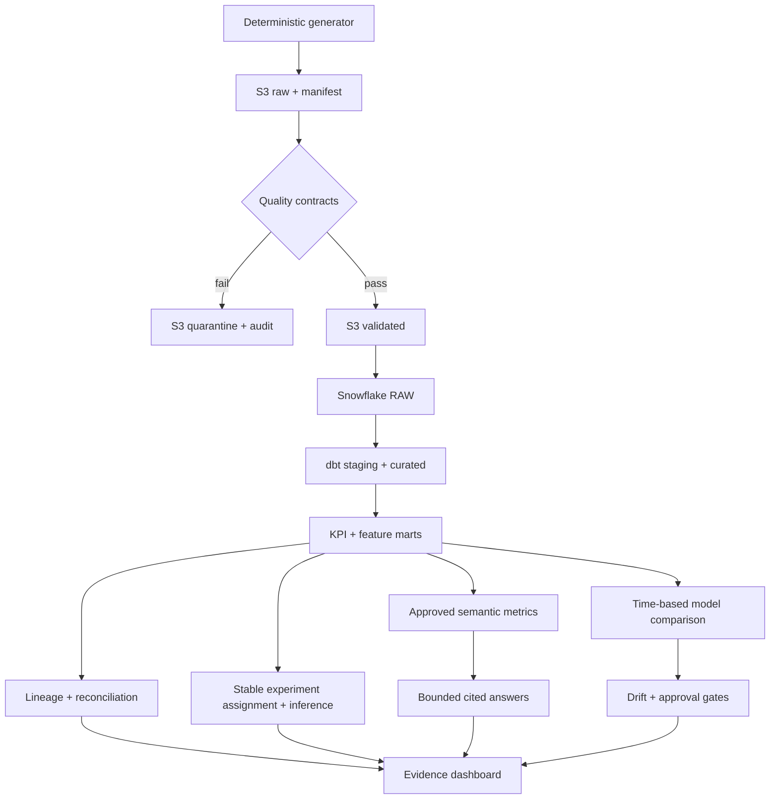

# GovernAI

[](https://github.com/Poojan-Desai/governai/actions/workflows/ci.yml)

**Evidence-first Data & AI governance portfolio by Poojan Desai**

GovernAI is an enterprise-style Data & AI governance platform built with safe,
deterministic simulated banking data. It makes the trust path visible: source
files, quality decisions, warehouse tables, dbt transformations, lineage,
privacy controls, reconciliation evidence, models, KPIs, and dashboards.

It is intentionally not another fraud classifier. FraudLens covers fraud ML;
GovernAI emphasizes data engineering, governance, cloud design,
experimentation, governed analytics, and responsible ML.

## Honest project status — 2026-08-17

| Scope | Implemented | Verified | Live status |
| --- | --- | --- | --- |
| Phase 1 local foundation | Python/SQL pipeline, quality gate, catalog, lineage, masking metadata, audit, KPI mart, OLS baseline, React UI | Full local suite + production build | Not applicable |
| Phase 2 integration code | Real boto3 S3 adapter, Snowflake connector, fail-closed orchestrator, reconciliation, cloud dashboard | Credential-free integration/contract tests | Not run |
| Phase 2 platform definitions | Terraform AWS resources, Snowflake DDL/RBAC/masking, dbt models/tests/docs | Static security contracts + file inspection | Not applied/executed |
| Phase 3A experimentation | Stable assignment, predeclared KPI, confidence interval, significance, sample-bounded impact, ROI assumptions, Experiment Lab | Seeded calculations match independent references + browser/build checks | Simulated locally; no live customer experiment |
| Phase 4A governed analytics | Approved semantic metrics, fixed read-only queries, citations, abstention, injection blocking | Numeric reconciliation + adversarial tests | Deterministic local prototype; no external LLM |
| Phase 5A responsible ML | Challenger backtest, drift monitoring, model card, limitations, approval gates | Independent formulas + production-block assertion | Research-only; no model-risk or production approval |
| Portfolio release | Recruiter overview, guided walkthrough, responsive dashboard, interview materials | Clean build, accessibility review, CI, public snapshot tests | Local release complete; hosted status recorded separately |

No AWS resource or Snowflake object was created in the development environment
for this revision because credentials, accounts, Terraform, dbt, and boto3 were
not available. The dashboard says **LIVE RUN NOT PERFORMED**. A live success is
recognized only when all three batch IDs, row counts, and SHA-256 values match
Snowflake audit evidence.

## What Phase 2 adds

- S3 `raw/`, `validated/`, `quarantined/`, and `curated/` zones with immutable
  batch paths, deterministic IDs, canonical manifests, object hashes, KMS
  encryption requests, and overwrite-conflict protection.
- Snowflake `RAW`, `STAGING`, `CURATED`, `ANALYTICS`, and `GOVERNANCE` layers;
  transactional COPY/MERGE loading and auditable batch evidence.
- A compact dbt DAG: three staging views, customer/account/transaction curated
  models, one explainable 30-day feature table, and one monthly KPI mart.
- Six job-function roles, future grants, and masking policies for names, email,
  phone, credit limits, transaction amounts, and confirmed loss.
- Python orchestration for `generate → manifest → S3 raw → quality gate → S3
  validated/quarantined → Snowflake → dbt → lineage → reconciliation`.
- Minimal Terraform for a private versioned S3 bucket, rotating KMS key,
  lifecycle controls, TLS enforcement, pipeline policy, and optional Snowflake
  storage-integration role.
- A cloud control-plane dashboard that separates locally verified code from
  unperformed live operations.

## What Phase 3A adds

- Stable account-level control/treatment assignment using deterministic SHA-256
  bucketing and separate assignment/outcome streams.
- A predeclared seven-day alert-enrollment KPI with explicit numerator,
  denominator, direction, alpha, confidence interval, and significance test.
- Sample-ratio-mismatch evidence, aggregate arm rates, absolute/relative lift,
  a 95% confidence interval, and a two-sided p-value.
- Sample-bounded impact and ROI with visible value and cost assumptions.
- An Experiment Lab that keeps a positive seeded result separate from a live
  customer or production claim.

See the [experiment contract](docs/EXPERIMENTATION.md) and
[Phase 3 status](docs/PHASE3_STATUS.md).

## What Phase 4A and Phase 5A add

- A governed analytics assistant that maps supported questions to versioned,
  read-only aggregate SQL templates and returns asset-level citations.
- Fail-closed prompt-injection checks and explicit abstention for unsupported
  questions. No external LLM call is hidden behind the interface.
- A research challenger evaluated with expanding-window, one-step-ahead folds
  against a previous-month baseline.
- Aggregate feature-drift monitoring using standardized mean difference,
  plus intended/prohibited use and human approval gates.
- A hard `BLOCKED` production state until model-risk and business approvals
  exist outside the demo.

See [governed assistant controls](docs/GOVERNED_ASSISTANT.md),
[model governance](docs/MODEL_GOVERNANCE.md), and the
[portfolio walkthrough](docs/PORTFOLIO_WALKTHROUGH.md).

## Architecture



See [Architecture](docs/ARCHITECTURE.md), [technology decisions](docs/TECHNOLOGY_DECISIONS.md),
and [live setup](docs/DEPLOYMENT.md).

## Run and verify locally

Requirements: Python 3.11+, Node.js 22+, and npm. No cloud credentials are
needed for the local evidence path.

```bash
npm install
npm run demo
npm run experiment:status
npm run assistant:status
npm run model:status
npm run cloud:status
npm test
npm run dev
```

`npm run demo` regenerates the local pipeline and all aggregate evidence.
`experiment:status`, `assistant:status`, and `model:status` print their bounded
evidence without row-level identifiers. `cloud:status` generates credential-safe
readiness evidence. `npm test` runs Python tests, frontend contracts, lint, and
the production build.

After completing [the live setup](docs/DEPLOYMENT.md), these commands make real
AWS/Snowflake calls and stop on any unsafe failure:

```bash
npm run cloud:run
npm run cloud:incident
```

## Repository map

| Path | Purpose |
| --- | --- |
| `backend/governai` | Local pipeline, cloud adapters, experiment engine, governed assistant, and model governance |
| `backend/tests` | Regression, failure, idempotency, reconciliation, privacy, statistics, adversarial, and model-evaluation tests |
| `infrastructure/terraform` | Minimal AWS S3/KMS/IAM infrastructure as code |
| `snowflake/sql` | Ordered warehouse, RBAC, stage, masking, and verification SQL |
| `dbt` | Staging, curated, feature, KPI, documentation, and data tests |
| `src` | Recruiter-friendly React/TypeScript control plane |
| `src/data` | Generated aggregate evidence bundled into the dashboard; never raw customer records |
| `docs` | Architecture, decisions, security, deployment, status, and interview prep |

No real customer data, bank systems, credentials, cloud-deployment claims,
customer experiment performance, LLM execution, or production model approval
is included. Simulated and research-only evidence is labeled wherever it
appears.
