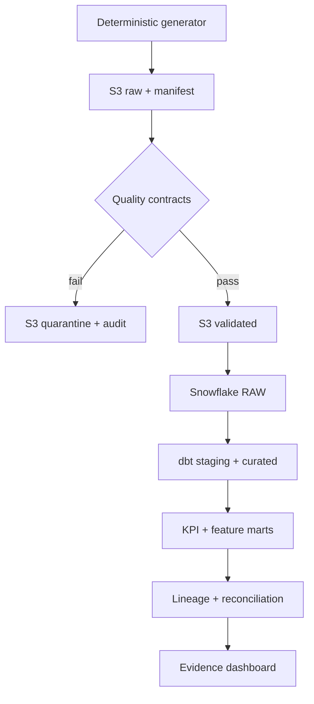

# GovernAI

GovernAI is an enterprise-style Data & AI governance platform built with safe,
deterministic simulated banking data. It makes the trust path visible: source
files, quality decisions, warehouse tables, dbt transformations, lineage,
privacy controls, reconciliation evidence, models, KPIs, and dashboards.

It is intentionally not another fraud classifier. FraudLens covers fraud ML;
GovernAI emphasizes data engineering, governance, cloud design, experimentation
(Phase 3), and responsible AI (later phases).

## Honest project status — 2026-08-10

| Scope | Implemented | Verified | Live cloud status |
| --- | --- | --- | --- |
| Phase 1 local foundation | Python/SQL pipeline, quality gate, catalog, lineage, masking metadata, audit, KPI mart, OLS baseline, React UI | Full local suite + production build | Not applicable |
| Phase 2 integration code | Real boto3 S3 adapter, Snowflake connector, fail-closed orchestrator, reconciliation, cloud dashboard | Credential-free integration/contract tests | Not run |
| Phase 2 platform definitions | Terraform AWS resources, Snowflake DDL/RBAC/masking, dbt models/tests/docs | Static security contracts + file inspection | Not applied/executed |
| Phase 3 experimentation | — | — | Planned; not implemented |
| Governed LLM | — | — | Planned; not implemented |

No AWS resource or Snowflake object was created in the development environment
for this revision because credentials, accounts, Terraform, dbt, and boto3 were
not available. The dashboard says **LIVE RUN NOT PERFORMED**. A live success is
recognized only when all three batch IDs, row counts, and SHA-256 values match
Snowflake audit evidence.

## What Phase 2 adds

- S3 `raw/`, `validated/`, `quarantined/`, and `curated/` zones with immutable
  batch paths, deterministic IDs, canonical manifests, object hashes, KMS
  encryption requests, and overwrite-conflict protection.
- Snowflake `RAW`, `STAGING`, `CURATED`, `ANALYTICS`, and `GOVERNANCE` layers;
  transactional COPY/MERGE loading and auditable batch evidence.
- A compact dbt DAG: three staging views, customer/account/transaction curated
  models, one explainable 30-day feature table, and one monthly KPI mart.
- Six job-function roles, future grants, and masking policies for names, email,
  phone, credit limits, transaction amounts, and confirmed loss.
- Python orchestration for `generate → manifest → S3 raw → quality gate → S3
  validated/quarantined → Snowflake → dbt → lineage → reconciliation`.
- Minimal Terraform for a private versioned S3 bucket, rotating KMS key,
  lifecycle controls, TLS enforcement, pipeline policy, and optional Snowflake
  storage-integration role.
- A cloud control-plane dashboard that separates locally verified code from
  unperformed live operations.

## Architecture



See [Architecture](docs/ARCHITECTURE.md), [technology decisions](docs/TECHNOLOGY_DECISIONS.md),
and [live setup](docs/DEPLOYMENT.md).

## Run and verify locally

Requirements: Python 3.11+, Node.js 22+, and npm. No cloud credentials are
needed for the local evidence path.

```bash
npm install
npm run demo
npm run cloud:status
npm test
npm run dev
```

`npm run demo` regenerates the Phase 1 evidence snapshot. `cloud:status`
generates credential-safe readiness evidence. `npm test` runs Python tests,
frontend contract tests, and the production build.

After completing [the live setup](docs/DEPLOYMENT.md), these commands make real
AWS/Snowflake calls and stop on any unsafe failure:

```bash
npm run cloud:run
npm run cloud:incident
```

## Repository map

| Path | Purpose |
| --- | --- |
| `backend/governai` | Phase 1 generator/pipeline and Phase 2 real cloud adapters |
| `backend/tests` | Regression, failure, idempotency, reconciliation, and privacy contracts |
| `infrastructure/terraform` | Minimal AWS S3/KMS/IAM infrastructure as code |
| `snowflake/sql` | Ordered warehouse, RBAC, stage, masking, and verification SQL |
| `dbt` | Staging, curated, feature, KPI, documentation, and data tests |
| `src` | Recruiter-friendly React/TypeScript control plane |
| `src/data` | Generated aggregate evidence bundled into the dashboard; never raw customer records |
| `docs` | Architecture, decisions, security, deployment, status, and interview prep |

No real customer data, bank systems, credentials, deployment claims, or invented
performance metrics are included.
