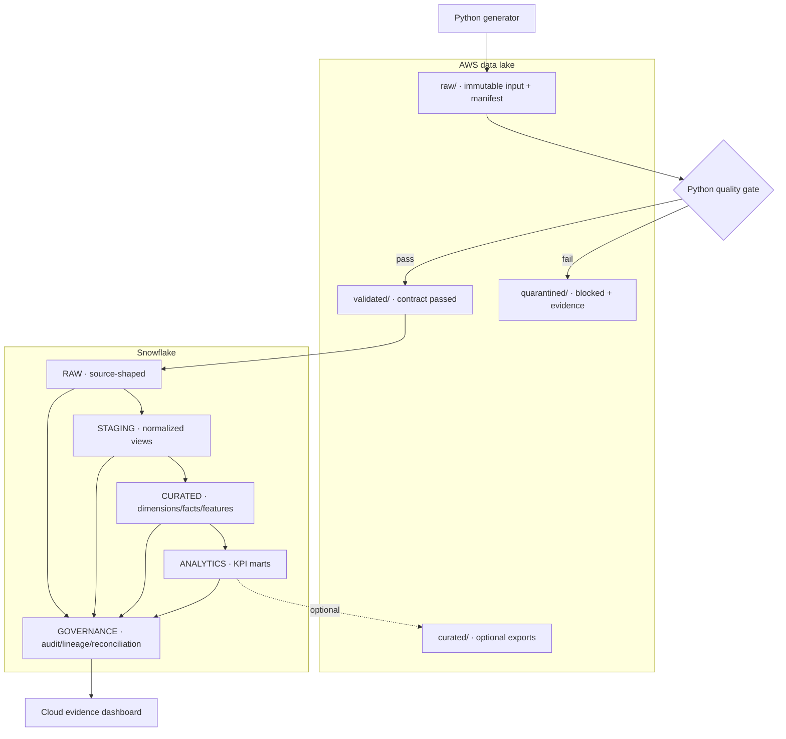
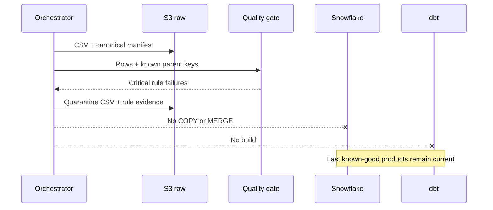

# Architecture

GovernAI asks: can a business user trust an analytical result, trace it to the
source, and see which controls protected it?

## Phase 2 execution path

`curated/` exists as a governed export boundary but is not populated by the
current pipeline. The system of record for Phase 2 curated products is
Snowflake; claiming an S3 export before one exists would be misleading.

## Data plane and control plane

The **data plane** contains records and derived products: CSV objects, RAW
tables, dbt views/tables, features, and KPI marts. The **control plane** contains
evidence about those records: manifests, batch states, quality results, policy
events, lineage edges, and reconciliation outcomes. Keeping them distinct lets
the pipeline fail while still preserving evidence about why it failed.

## Fail-closed incident sequence

## Idempotency and reconciliation

The batch ID is the first 16 hexadecimal characters of SHA-256 over stable asset
ID, source SHA-256, and batch label. Repeating identical input therefore targets
the same S3 keys and Snowflake audit row. S3 returns the existing object only if
its content hash matches; otherwise it refuses to overwrite. Snowflake skips a
successful batch only when stored row count and source hash match.

After dbt succeeds, reconciliation compares three independent manifest fields:
batch ID, accepted row count, and source SHA-256. Missing or different evidence
sets the run to `RECONCILIATION_FAILED`; only three `MATCHED` results produce a
live-verified dashboard status.

## Current boundary

Phase 2 contains production-facing adapters, SQL, dbt, and Terraform plus local
test doubles used only for deterministic tests. No cloud endpoint was available
in the build environment, so runtime semantics such as Snowflake SQL execution,
AWS IAM trust, and service-specific error behavior still require the live gate.
