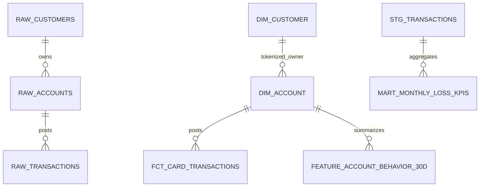

# Data model

| Snowflake object | Grain | Materialization | Governance purpose |
| --- | --- | --- | --- |
| `RAW.CUSTOMERS` | One accepted customer | Loader-owned table | Synthetic direct identifiers; masking applied |
| `RAW.ACCOUNTS` | One accepted account | Loader-owned table | Parent/child relationship and credit-limit mask |
| `RAW.TRANSACTIONS` | One accepted transaction | Loader-owned table | Batch/hash evidence and financial masks |
| `STAGING.STG_*` | One normalized source row | dbt view | Standardize case/types while retaining evidence |
| `CURATED.DIM_CUSTOMER` | One customer | dbt table | Deterministic token and masked email |
| `CURATED.DIM_ACCOUNT` | One account | dbt table | Tokenized customer relationship |
| `CURATED.FCT_CARD_TRANSACTIONS` | One transaction | dbt table | Governed fact with no direct customer PII |
| `CURATED.FEATURE_ACCOUNT_BEHAVIOR_30D` | Account/latest as-of date | dbt table | Explainable behavioral features, not a classifier |
| `ANALYTICS.MART_MONTHLY_LOSS_KPIS` | UTC calendar month | dbt table | Dashboard-ready loss totals and rates |

`GOVERNANCE.BATCH_LOADS`, `PIPELINE_EVENTS`, `RECONCILIATION_RESULTS`,
`LINEAGE_EDGES`, and `ACCESS_POLICY_EVENTS` form the Snowflake control plane.
Every raw table retains `BATCH_ID`, `SOURCE_SHA256`, and `LOADED_AT`; the fact
retains the batch/hash fields so a result can be traced to a source object.

Snowflake primary-key declarations are informational (`NOT ENFORCED`), so dbt
uniqueness and relationship tests are the executable integrity controls.
