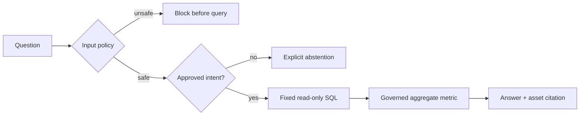

# Governed analytics assistant

Phase 4A demonstrates the control boundary around analytical question answering.
It is a deterministic local prototype over simulated aggregate data. It does
not call an external language model and is not represented as a production
natural-language-to-SQL system.

## Answer path

The router supports four bounded questions:

| Intent | Metric | Source asset |
| --- | --- | --- |
| Latest confirmed loss | `confirmed_loss_usd` | `mart.monthly_loss_kpis` |
| Highest-loss month | `confirmed_loss_usd` | `mart.monthly_loss_kpis` |
| Accepted transaction count | `accepted_transaction_count` | `curated.fct_card_transactions` |
| Latest quarantine outcome | `quarantined_row_count` | `source.card_transactions` |

Each successful response includes the reviewed SQL template, metric ID, asset
ID, record scope, and cited field. The frontend consumes only aggregate answer
evidence.

## Fail-closed controls

- Inputs longer than 240 characters or containing unsafe SQL/instruction tokens
  are blocked before any database access.
- SQL is selected from immutable code-owned templates; user content is never
  concatenated into a query.
- Templates are read-only and constrained to approved aggregate/control-plane
  tables.
- Unsupported questions return `ABSTAINED` instead of generating an answer.
- Tests reconcile displayed numbers directly to the governed tables and prove
  an adversarial `DROP TABLE` prompt cannot change the database.

## Production work still required

A production assistant would need identity-aware row/column authorization,
query budgets and timeouts, result-size limits, durable audit retention,
tenant isolation, external-model prompt and output evaluations, citation
coverage metrics, and operational monitoring. Phase 4A intentionally proves
the policy semantics before adding a probabilistic model.
